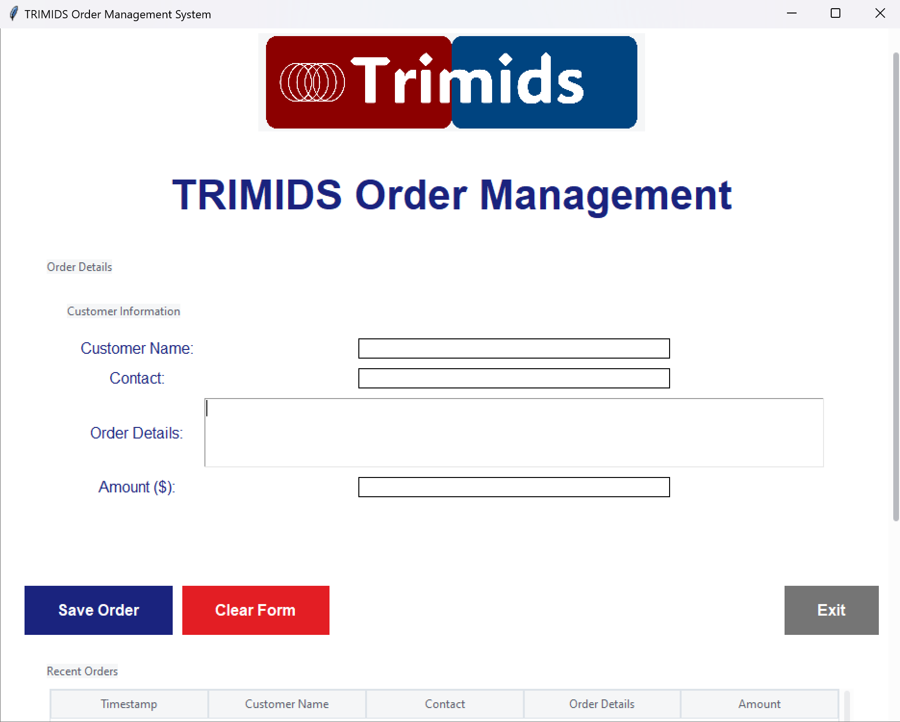

# TRIMIDS Order Management System 🚀



A modern, user-friendly desktop application for managing customer orders with Google Sheets integration and local Excel backup.

## ✨ Features

- 📝 Clean and intuitive order entry interface
- 🔄 Real-time synchronization with Google Sheets
- 💾 Local Excel backup
- 📊 Order history tracking
- 🎨 Modern UI with scrollable interface
- 🖼️ Custom logo support

## 🚀 Getting Started

### Prerequisites

- Python 3.7+
- pip package manager

### Installation

1. Clone the repository
```bash
git clone https://github.com/yourusername/trimids-order-manager.git
```

2. Navigate to the project directory
```bash
cd trimids-order-manager
```

3. Install required dependencies
```bash
pip install -r requirements.txt
```

### Detailed Google Sheets & Credentials Setup

#### Google Cloud Console Setup:

1. **Visit Google Cloud Console**:
   - Create a new project or select an existing one.
   - Note down your Project ID.

2. **Enable APIs**:
   - Go to "APIs & Services" > "Library".
   - Search for "Google Sheets API" and click "Enable".
   - Also enable the "Google Drive API".

3. **Create Service Account**:
   - Go to "APIs & Services" > "Credentials".
   - Click "Create Credentials" > "Service Account".
   - Fill in the following:
     - **Service account name**: trimids-order-manager
     - **Service account ID**: (will auto-generate)
     - **Description**: "Service account for TRIMIDS Order Manager"
   - Click "Create and Continue".

4. **Generate credentials.json**:
   - Find your service account in the credentials list.
   - Click on the service account email.
   - Go to the "Keys" tab.
   - Click "Add Key" > "Create new key".
   - Choose JSON format.
   - Download the file and rename it to `credentials.json`.
   - Place it in your project root directory.

#### Google Sheet Setup:

1. **Create a new Google Sheet**.
2. **Name it "Orders"**.
3. Copy the email address from your `credentials.json` file (`client_email` field).
4. Share your sheet with this email address (Editor access).
5. Keep note of the Sheet ID from the URL.

#### Verify `credentials.json` structure:

```json
{
  "type": "service_account",
  "project_id": "your-project-id",
  "private_key_id": "your-key-id",
  "private_key": "your-private-key",
  "client_email": "your-service-account-email",
  "client_id": "your-client-id",
  "auth_uri": "https://accounts.google.com/o/oauth2/auth",
  "token_uri": "https://oauth2.googleapis.com/token",
  "auth_provider_x509_cert_url": "https://www.googleapis.com/oauth2/v1/certs",
  "client_x509_cert_url": "your-cert-url"
}
```

### Running the Application

1. Place your company logo as `logo.png` in the project directory.
2. Run the application:
   ```bash
   python order_manager.py
   ```

## 💡 Usage

### Enter Customer Details:
- Fill in customer name, contact information.
- Add detailed order description.
- Enter order amount.

### Save Order:
- Click "Save Order" to store in both Google Sheets and local Excel.
- View confirmation message.

### View Orders:
- Recent orders appear in the table below.
- Scroll through order history.

### Clear Form:
- Use "Clear Form" button to reset all fields.

## 🛠️ Tech Stack

- Python
- Tkinter (GUI)
- pandas (Data Management)
- Google Sheets API
- PIL (Image Processing)
- ttkthemes (Modern Styling)

## 📁 File Structure

```
trimids-order-manager/
├── order_manager.py
├── credentials.json
├── logo.png
├── orders.xlsx
└── requirements.txt
```

## 📊 Technical Details

### Main Components

- **ModernOrderManager Class**: Core UI class handling the entire application interface.
- **Google Sheets Integration**: Real-time data sync with cloud storage.
- **Local Excel Backup**: Automatic order backup in Excel format.
- **Scrollable Interface**: Handles large amounts of order data efficiently.

### Key Functions

- `connect_to_google_sheet()`: Establishes connection to Google Sheets.
- `save_to_google_sheet()`: Handles cloud data storage.
- `create_excel_template()`: Initializes local Excel storage.
- `save_order()`: Processes and saves order data.
- `load_orders()`: Retrieves existing order history.

### UI Elements

- **Header Section**:
  - Company logo display.
  - Application title.

- **Order Form**:
  - Customer name field.
  - Contact information.
  - Order details text area.
  - Amount input.

- **Action Buttons**:
  - Save Order.
  - Clear Form.
  - Exit.

- **Order List**:
  - Scrollable table view.
  - Recent orders display.
  - Timestamp tracking.

### Data Storage Structure

**Excel/Google Sheets Format**:
- Timestamp
- Customer Name
- Contact
- Order Details
- Amount

### Error Handling
- Input validation.
- Google Sheets connection errors.
- Excel file operations.
- Data type verification.

## System Requirements

### Minimum Hardware:
- 2GB RAM
- 1GHz Processor
- 100MB Free Disk Space

### Software Dependencies:
- Windows/Linux/MacOS
- Python 3.7+
- Active internet connection for cloud sync

## 🤝 Contributing

Contributions, issues, and feature requests are welcome!

## 📝 License

This project is MIT licensed.

## 🙋‍♂️ Support

For support, email supuntharakapro999@gmail.com or create an issue in the repository.

Made with ❤️ by Supun Tharaka
